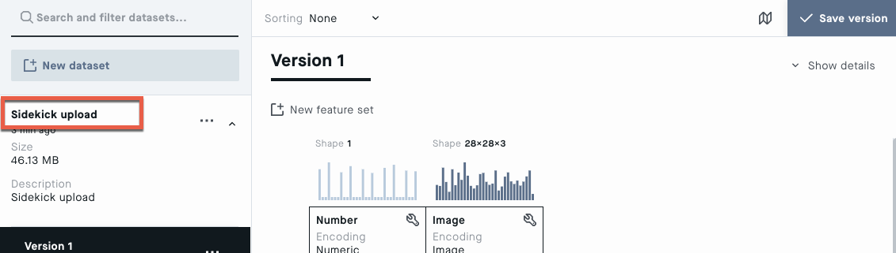

# Sidekick (Beta) [](https://travis-ci.com/Peltarion/sidekick)

Sidekick is a package that helps you interact with features on the Peltarion platform. It serves to perform things that are either not yet implemented on the platform but are needed for solving a machine learning project end-to-end or simplifies the interaction with features you might do several times in a project, s.a. making predictions from a trained model. Multiple types of data are supported (tabular, text, images), but with most development on tabular data.

Currently, Sidekick allows you to do the following:

* Prepare your data to create splits, remove missing values, and more
* Inspect data you want to upload to the Platform
* [Convert your dataset to work with the Platform](#make-your-data-have-a-format-that-is-supported-on-the-platform)
* [Upload your prepared data to the Platform](#upload-dataset-through-the-peltarion-platform's-data-api)
* [Make predictions with models you have trained on the Platform](#make-predictions-with-a-trained-and-deployed-model-on-the-platform)

If you experience any issues or feel that features are missing from Sidekick, you can always open an issue [here](https://github.com/Peltarion/sidekick/issues/new/choose)

## Getting started with Python

If you are unfamiliar with Python and how to install it, we recommend that you install Anaconda, a method that simplifies your python installation:

* [Install Anaconda](https://docs.anaconda.com/anaconda/install/)

If you just want to install python, you can follow one of the guides listed here:

* [Setting up Python3](https://docs.python-guide.org/starting/installation/#python-3-installation-guides)
* [Learning Python](https://realpython.com/python-first-steps/#how-to-download-and-install-python)

## Installation of sidekick

**Requirements** Sidekick requires python version 3.5 or newer.

If you are unfamiliar with python and how to install python, we recommend you follow the section [Getting started with python](#getting-started-with-python)

We also recommend you to create a virtual environment and install Sidekick there. This is a general best practice in python and ensures that only the packages we need are installed and with the correct versions.

Here are some guides for setting up and activating a virtual environment. These guides assumes that you have installed Anaconda or python and are running these commands in a terminal:

* [Creating a virtual environment](https://realpython.com/python-virtual-environments-a-primer/#create-it)
* [Activating the virtual environment](https://realpython.com/python-virtual-environments-a-primer/#activate-it)

Once the virtual environment is activated you can install Sidekick directly from Github:

```shell
pip install git+https://github.com/Peltarion/sidekick#egg=sidekick
```

## `TODO` Prepare data


## `TODO` Inspect data


## Make your data have a format that is supported on the platform

When creating a dataset zip you can load the data in two separate ways.
Both require loading the data in a Pandas `DataFrame` and assume all columns
only contain one type of data with the same shape.

### 1) Load data in memory objects

Store objects directly in the `Series` (columns of your `DataFrame`). This
works for all scalars (floats, integers and strings of one dimension) as well
as [Pillow](https://pillow.readthedocs.io/en/stable/) images and numpy arrays.

#### Example

This is such an example with a progressbar enabled:

```python
df.head()
```

```text
float_column          image_column                numpy_column
    0.248851  <PIL.Image.Image ...  [0.18680, 0.61951, 0.83...
    0.523621  <PIL.Image.Image ...  [0.75213, 0.44948, 0.82...
    0.647844  <PIL.Image.Image ...  [0.41525, 0.63858, 0.34...
    0.447717  <PIL.Image.Image ...  [0.79373, 0.24514, 0.94...
    0.194222  <PIL.Image.Image ...  [0.12636, 0.40554, 0.66...
```

```python
import sidekick

# Create dataset
sidekick.create_dataset(
    'path/to/dataset.zip',
    df,
    progress=True
)
```

### 2) Load data in paths to objects

Columns may also point to paths of object. Which columns are paths should be
indicated in the `path_columns`. Like the in-memory version these may also be
preprocessed.

#### Example

This is an example where all images are loaded from a path,
preprocessed to have the same shape and type and then placed in the dataset.

```python
df.head()
```

```text
float_column string_column                                  image_file_column
    0.248851           foo  /var/folders/7t/80jfy0rd3l7f31xdd3rw0_jw0000gn...
    0.523621           foo  /var/folders/7t/80jfy0rd3l7f31xdd3rw0_jw0000gn...
    0.647844           foo  /var/folders/7t/80jfy0rd3l7f31xdd3rw0_jw0000gn...
    0.447717           foo  /var/folders/7t/80jfy0rd3l7f31xdd3rw0_jw0000gn...
    0.194222           foo  /var/folders/7t/80jfy0rd3l7f31xdd3rw0_jw0000gn...
```

```python
import functools
import sidekick

# Create preprocessor for images, cropping to 32x32 and formatting as png
image_processor = functools.partial(
    sidekick.process_image, mode='center_crop_or_pad', size=(32, 32), file_format='png')

# Create dataset
sidekick.create_dataset(
    'path/to/dataset.zip',
    df,
    path_columns=['image_file_column'],
    preprocess={
        'image_file_column': image_processor
    }
)
```

## Upload dataset through the Peltarion Platform's Data API

Peltarion provides a public Data API that enables the users to programmatically get data into the
platform.


#### Example

This example shows how to upload a single file to the Peltarion Platform.


Use the `url` and `token` displayed in the modal that appears when clicking the `Data API` button in the Dataset view.

```python
import sidekick

client = sidekick.DatasetClient(url='<url>', token='<token>')
```

This dataset client may now be used to upload one or many files to the Data API service. Uploading files will create a
dataset to the project that the token is tied to. The Data API consumer could provide `dataset_name` and
`dataset_description` to the dataset. If omitted, default name and description will be set to `Sidekick upload`

```python
filepaths = ['path/to/dataset.zip']
response = client.upload_data(
    filepaths=filepaths,
    name='My dataset',
    description='My description'
)
```



## Make predictions with a trained and deployed model on the Platform

To connect to an enabled deployment use the `sidekick.Deployment` class. This
class takes the information you find on the deployment page of an experiment.

#### Example

This example shows how to query an enabled deployment for image classification.


Use the `url` and `token` displayed in the dark box.

```python
import sidekick

client = sidekick.Deployment(url='<url>', token='<token>')
```

This deployment client may now be used to get predictions for images.

The feature specifications from the table of input and output parameters can be accessed as a
property of the client object:

```python
# input features
client.feature_specs_in

# output features
client.feature_specs_out
```

### Test deployment with one sample - predict

To predict result of one image (here `test.png`) use `predict`.

#### Example

```python
from PIL import Image

# Load image
image = Image.open('test.png')

# Get predictions from model
client.predict(image=image)
```

Note: If the feature name is not a valid python variable, e.g., `Image.Input`, use `predict_many` instead of `predict`.

### Test deployment with many samples - predict_many

To efficiently predict the results of multiple input samples (here, `test1.png`, `test2.png`) use
`predict_many`.

#### Example

```python
client.predict_many([
    {'image': Image.open('test1.png')},
    {'image': Image.open('test2.png')}
])
```

### Interactive exploration of data - predict_lazy

For interactive exploration of data it is useful to use the `predict_lazy`
method, which returns a generator that lazily polls the deployment when needed.
This allows you to immediatly start exploring the results instead of waiting
for all predictions to finnish.

#### Example

```python
client.predict_lazy([
    {'image': Image.open('test1.png')},
    {'image': Image.open('test2.png')}
])
```

### Compatible filetypes

The filetypes compatible with sidekick may shown by:

```python
print(sidekick.encode.FILE_EXTENSION_ENCODERS)
```

# Examples

Examples of how to use sidekick are available at: [examples/](examples/).
To start the notebooks (ends with extention .ipynb), you will need to install jupyter notebook and run those files with jupyter.

If you have installed Anaconda, then jupyter notebook is already installed and can be started by executing the following command in your terminal:

```shell
jupyter notebook
```

If this command is not recognized, you can install jupyter notebook by following one of these guides:

* https://jupyter.org/install
* https://docs.jupyter.org/en/latest/install/notebook-classic.html


# TODO:

- [ ] Create notebook covering the data exploration and preprocessing end-to-end --> https://peltarion.com/knowledge-center/documentation/datasets-view/data-preprocessing

- [ ] Make notebook for more extensive visualization - https://www.kaggle.com/code/pmarcelino/comprehensive-data-exploration-with-python/notebook
    - [ ] Find correlation automatically
    - [ ] Make scatter plot for specific features

- README
  - [-] Update README to simplify for new users
  - [ ] Provide instructions for installing and starting preprocessing [examples/preprocess-and-inspect-data.ipynb](examples/preprocess-and-inspect-data.ipynb)
  - [ ] Consider moving examples of how to use sidekick to separate notebooks
  - [ ] Link to notebooks/examples of what sidekick can do when mentioned in the beginning on the README

- Data Preprocessing functionality
  - [ ] Explain data-leakage on column level
  - [ ] Inconsistent column labels (1 vs "1")
  - [X] Allow dataset splits based on distributions for train, valid, test
  - [X] Visualize Set sizes, basic data distributions
  - [X] Explain class imbalance
  - [X] Make sure there are no imputed target values
  - [X] Make sure that all functions are tested
  - [X] Include the new augmented dataset
  - [X] Test upload dataset to platform
  - [ ] Refactor and improve the names of new functions

- Issues that should be opened and worked on later
  - [ ] Allow inspect to work for more data types.
  - [ ] Allow impute to work for more data types
